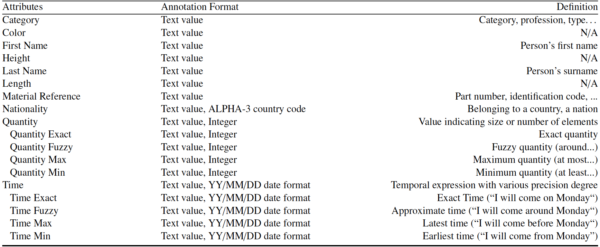
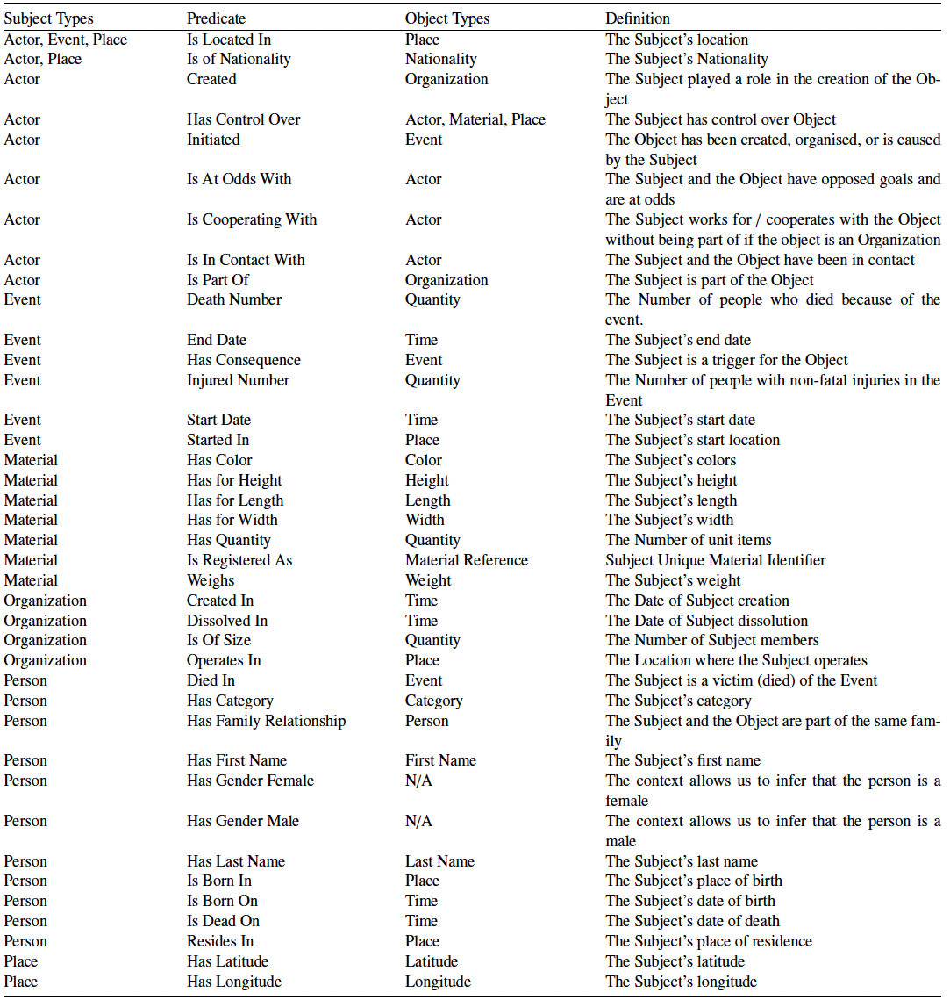
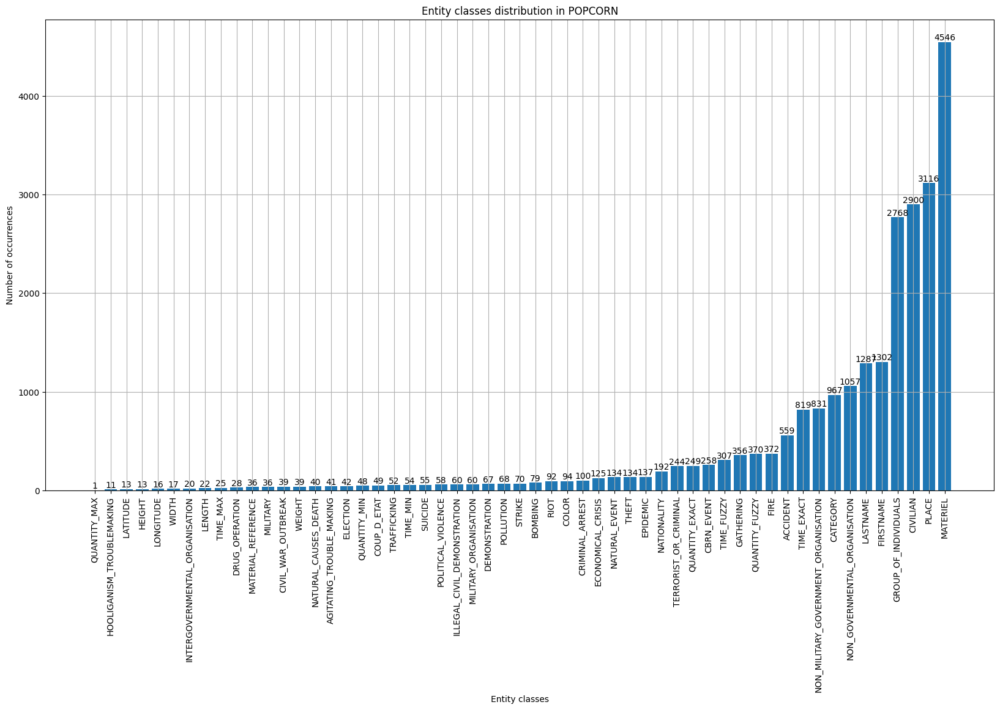
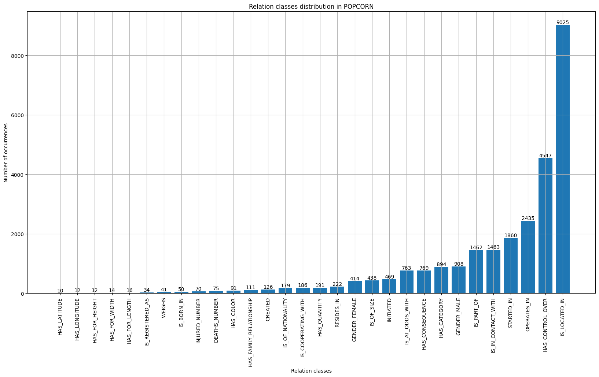

# POPCORN Dataset

<p align="justify"> This directory contains the POPCORN French dataset. This dataset is divided into 400 validation and 400 training texts. The texts in this dataset were written and annotated manually. The texts are short and factual, in the style of an information report. Annotation based on the ontology described below enables training and evaluation of Information Extraction (Name Entity Recognition, Coreference Resolution and Relation Extraction) models. </p>

## POPCORN Dataset Format
The annotated texts are stored inside the corpus folder of this repository and split between the "train.json" and "test.json" files. Each file contains 400 texts stored as a 3 keys dictionary : 

```rb
{
 "text": "the raw text as a string",
 "entities": [{
                "id": "id of the textual entity",
                "mentions": [{
                              "value": "textual value of the mention"
                              "start": "offset of the begin of the mention in the text as integer",
                              "end": "offset of the end of the mention in the text as integer"
                             },
                             ...
                            ],
                "type": "entity type as a string",
                "value": "if the entity is an attribute with a formatted value"
               },
               ...
              ],
 "relations": [ [subject_id, predicate, object_id],
                ...
               ]
}
```

## POPCORN Ontology
This section lists the different types of entities, attributes and relations used to annotate the dataset. Although the classes are displayed in such a way as to indicate a given taxonomy, only the fine-grained classes (the most indented in the table) are annotated in the dataset. The parent classes are therefore given for information only and can be re-organised according to the use-case.






In the provided annotations, gender is annotated as 2 relations (Male or Female) using the same entity as subject and object.

## POPCORN Type Distribution





As shown in the previous figures this dataset is imbalanced both with entities and relations. Users may choose to discard low support classes.

# Benchmark

| Models | Event Extraction (Macro F1)| Entity Extraction (Macro F1) | Attribute Extraction (Macro F1) | Relation Extraction (Macro F1) | Coreference Resolution (F1 : Avg MUC, B3, CEAF) |
| ------- | --- | --- | --- | --- | --- |
| Unified Model | 45.19 &pm; 2.07 | 68.38 &pm; 0.34 | 60.39 &pm; 2.76 | 46.49 &pm; 0.55 | TBD |
| Boundary Smoothing Model | 44.20 &pm; 1.01 | 63.56 &pm; 0.82 | 60.67 &pm; 0.95 | N/A | N/A |

Above table list the best results of 2 architectures for POPCORN tasks.

# Citation

# Contact
If you have any questions, please contact cedric.lopez@emvista.com

# TODO
- [ ] Upload the Unified Model implementation
- [ ] Complete the benchmark section with coreference resolution results
